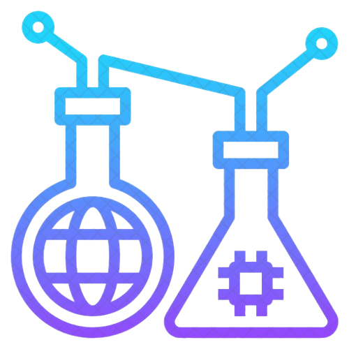

  
# About Me  

<table>
<tr>
<td width="200" align="center">

</td>
<td width="420" align="left">

### 👋 **Hi, I'm Ichina!**
🌍 **Location:** Japan 🇯🇵  
🔬 **AI Researcher & Software Engineer**   
✨ **Focus:** Reverse Engineering → Documentation → Migration   
🎯 **Goal:** Modernizing legacy systems with AI🤖

</td>
</tr>
</table>

<!--- ------------------------------------------------------------------------------------------------------------------------------------------------------ -->
<!--- -- Skills Section ------------------------------------------------------------------------------------------------------------------------------------ -->
<!--- ------------------------------------------------------------------------------------------------------------------------------------------------------ -->

# Skills  

| Category        | Skills        |
|-----------------|---------------|
| Frameworks |    |
| AI / LLM |     |
| RE  |      |
| Languages |         |
| Styling & Frameworks |    |
| Database / Data |     |
| Services & Tools |       |
| Competitive Coding |  |
| IDE & Environment |       |
| Hosting / Cloud |   |
| APIs / Protocols |     |
| Design Tools |       |
| Learning | |

  

 

## **GitHub Analytics**📊

<!-- Streak -->

  

<!-- Activity Graph -->

  

